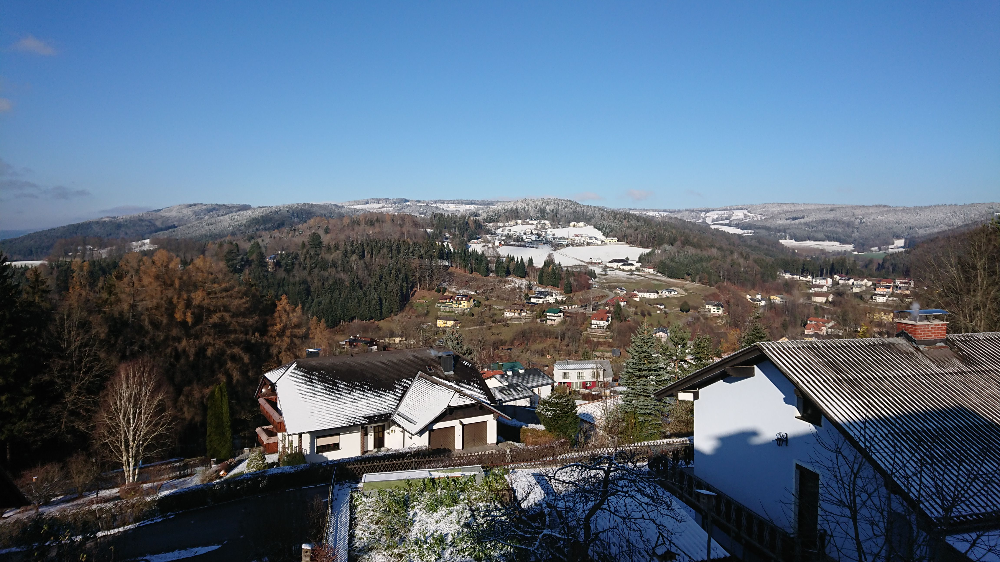

# Helfenberg

Die Gemeinde Helfenberg liegt im Bezirk Rohrbach im oberen Mühlviertel in Oberösterreich mit 1005 Einwohnern (Stand 1. Jänner 2018). Der zuständige Gerichtsbezirk ist Rohrbach in Oberösterreich. Sie ist die Heimatgemeinde des ÖVP-Politikers und Vizekanzlers a. D. Reinhold Mitterlehner. 

## Geografie

Helfenberg liegt auf einer Höhe von 567 m ü. A. im oberen Mühlviertel nahe an der tschechischen Grenze. Bezogen auf die naturschutzfachliche Raumgliederung gehört der Großteil des Gemeindegebietes zu den Südlichen Böhmerwaldausläufern sowie der Südosten des Gemeindegebietes zum Zentralmühlviertler Hochland. Die Ausdehnung beträgt von Nord nach Süd 2,9 km, von West nach Ost 4,4 km. Die Gesamtfläche beträgt 9,61 km², womit Helfenberg die fünftkleinste Gemeinde des Bezirks Rohrbach ist. Jedoch weist die Gemeinde mit 99 Einwohnern pro km² die siebthöchste Bevölkerungsdichte der Gemeinde des Bezirks auf. 2001 war das Gemeindegebiet zu 36,1 mit Wald bedeckt, 54,6 Prozent der Fläche wurde landwirtschaftlich genutzt. Im Vergleich mit dem Bundesland Oberösterreich ist Helfenberg damit etwas weniger bewaldet als der Landesschnitt (Oberösterreich: 38,3 Prozent) bzw. steht etwas mehr landwirtschaftliche Nutzfläche zur Verfügung (Oberösterreich: 49,3 Prozent). Der Anteil sonstiger Nutzungen (Bauflächen, Gärten, Gewässer und anderes) liegt mit rund 9,3 Prozent leicht hinter dem Oberösterreichischen Durchschnitt von 13,8 Prozent. Nachbargemeinden sind Vorderweißenbach im Osten (Bezirk Urfahr-Umgebung), Ahorn im Südosten und Süden, St. Peter am Wimberg im Südwesten, St. Stefan am Walde im Westen und Afiesl im Norden. 

## Geschichte

Am Anfang des 13. Jahrhunderts wurde der Ort erstmals urkundlich erwähnt. In dieser Zeit wurden sowohl das Schloss Helfenberg als auch die Burg Piberstein erbaut.
Ursprünglich im Ostteil des Herzogtums Bayern liegend, gehörte der Ort seit dem 12. Jahrhundert zum Herzogtum Österreich. Seit 1490 wird er dem Fürstentum Österreich ob der Enns zugerechnet. Während der Napoleonischen Kriege war der Ort mehrfach besetzt. Seit 1918 gehört der Ort zum Bundesland Oberösterreich.
Nach dem Anschluss Österreichs an das Deutsche Reich am 13. März 1938 gehörte der Ort zum Gau Oberdonau. Nach 1945 erfolgte die Wiederherstellung Oberösterreichs.
Von jeher war Helfenberg als Ort der Textilerzeugung und Weberei bekannt. Im Zuge der Industrialisierung errichteten die Gebrüder Simonetta aus Mailand 1843 eine Leinenweberfabrik, die zu Hochzeiten 1200 Personen beschäftigte. 

Quelle: [Wikipedia - Helfenberg](https://de.wikipedia.org/wiki/Helfenberg)

# Bild
Winterliches Helfenberg

