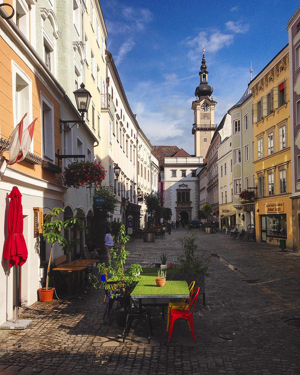

#Linz

##Allgemein
Linz ist die Landeshauptstadt von Oberösterreich und mit 204.846 Einwohnern (Stand 1. Jänner 2018)[2] nach Wien und Graz die drittgrößte Stadt Österreichs und das Zentrum des mit 789.811[3] Menschen zweitgrößten Ballungsraumes der Alpenrepublik.
Die Stadt an der Donau hat eine Fläche von 95,98[4] km² und ist Zentrum des oberösterreichischen Zentralraums. Als Statutarstadt ist sie sowohl Gemeinde als auch politischer Bezirk; außerdem Sitz der benachbarten Bezirkshauptmannschaften von Linz-Land und Urfahr-Umgebung.

Nach dem Ende des Zweiten Weltkriegs, 1945, hatte Linz den Ruf einer staubigen Stahlstadt, den sie dem größten Arbeitgeber, den Stahlwerken der Voestalpine AG, verdankte. Doch durch verbesserten Umweltschutz und zahlreiche Initiativen im Kulturbereich, beispielsweise Veranstaltungen wie die Linzer Klangwolke, das Brucknerfest, das Pflasterspektakel und den Prix Ars Electronica bzw. das Ars-Electronica-Festival, gewinnt die Stadt sukzessive ein neues Image; seit 2004 wird jährlich das Filmfestival Crossing Europe veranstaltet. 2013 wurde das neue Musiktheater am Volksgarten, ein modernes Theater- bzw. Opernhaus, eröffnet. Linz konnte sich mit diesen und weiteren Initiativen als Kulturstadt positionieren, wobei auch Strukturen der alten Industriestadt zum Teil noch sichtbar sind. Dazu passend weist Linz als Universitätsstadt mit mehreren Universitäten auch zahlreiche Studienangebote im künstlerischen und kulturellen Bereich auf.
Die Stadt ist namensgebend für die Linzer Torte, deren Rezept als das älteste bekannte Tortenrezept der Welt gilt.
Die Stadt wird inoffiziell auch als Linz an der Donau bezeichnet, um nicht mit der deutschen Stadt Linz am Rhein verwechselt zu werden.

## Geografie
Linz liegt im östlichen Oberösterreich und erstreckt sich auf beiden Seiten der Donau. Die Nord-Süd-Ausdehnung beträgt 18,6 km, die Ost-West-Ausdehnung 12,3 km.[19] Die Stadt befindet sich im Linzer Becken und grenzt im Westen an den Kürnberger Wald sowie das fruchtbare Eferdinger Becken. Nördlich der Donau, im Stadtteil Urfahr, wird Linz durch den Pöstlingberg (539 m), den Lichtenberg (927 m) und die Hügel bzw. Berge des Mühlviertels begrenzt. Die östliche Stadtgrenze ist durch die Donau markiert, welche das Stadtgebiet in einem nordost-südöstlichen Halbkreis erst durch-, und dann umfließt. Die Traun mündet 7 km südöstlich des Stadtzentrums in die Donau und markiert die innerstädtische Grenze zum größten Stadtteil Ebelsberg. Südlich der Stadt beginnt das Alpenvorland.

Quellle aus https://de.wikipedia.org/wiki/Linz

quelle foto: https://www.flickr.com/photos/jochenlorenz/27790626114/in/photolist-JkLdW7-25c4kcj-rihqfF-2bwsYtv-oC28h5-ebPQ2R-qpns2o-raDcVn-nz7Cvt-te26Ry-kyNKC8-2N9Dm-hKNL9i-a1Af38-dzPygo-gSyPMK-pHQf4b-jweBfx-rB2hYr-ggTqDS-iFjmFr-27jetTu-anxzuX-ahoneC-RL5EoU-m6qcoM-n3R1Ed-ndEs1e-SBmNmU-b9LdnB-27FTEMX-L4EiBC-9TZzNV-9nWjVN-fExqLJ-nyzDVe-iRrZ8v-7mBHvd-pgor2L-in5Qc-ck2VfY-6MRppE-jus7nP-V7dyHf-WXryaf-Zv512Y-guR4mB-FYWgLs-nfpfxC-AF5Gjc
