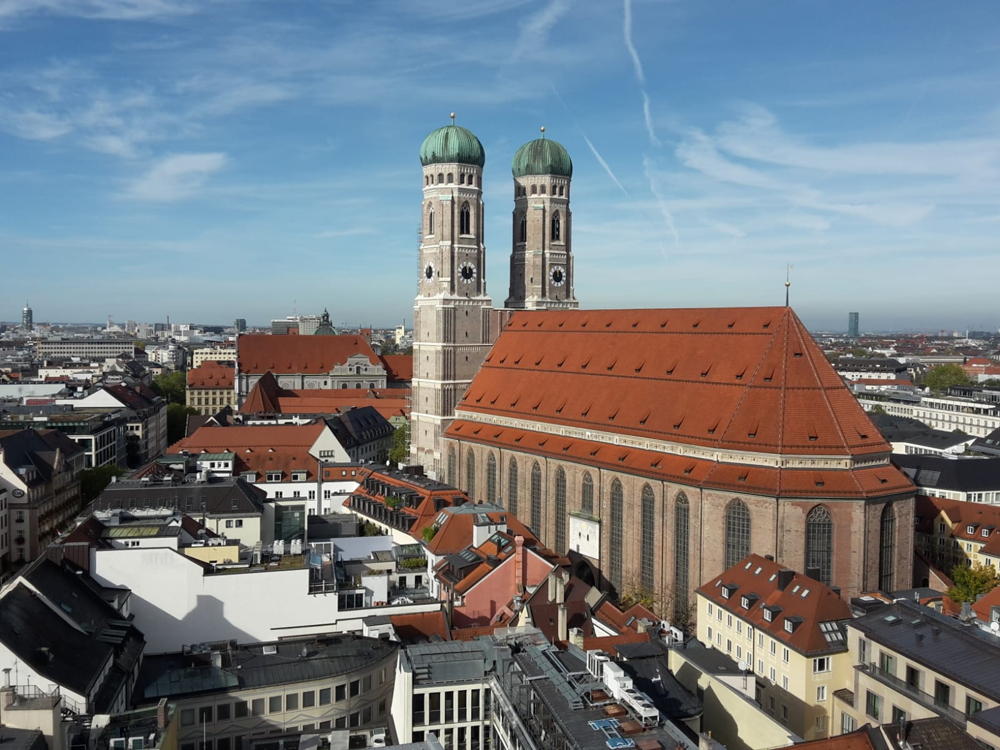

# k01606968

## Meine Städte München und Traun
**München** ist die Landeshauptstadt Bayerns und auch unter den Beinamen `nördlichste Stadt Italiens`, `Weltstadt mit Herz` oder `Millionendorf` bekannt. Besonders an München sind - neben der Wiesn - die vielen Grünanlagen, die Biergärten (Essen darf selbst mitgebracht werden), die Isar und das Tollwood-Festival, welches im Sommer und im Winter stattfindet. Bei Föhnwetterlage lässt sich vom Turm des St. Peter (Alter Peter) nicht nur die Innenstadt betrachten, sondern auch ein herrlicher Blick auf die Alpen genießen. Der Viktualienmarkt hat Mo-Sa geöffnet und lädt zum Naschen, Verweilen und Genießen ein. Kulturell hat München mehrere Museen z.B. Pinakothek der Moderne, Neue Pinakothek, Deutsches Museum... sowie zahlreiche Veranstaltungen und Konzerte zu bieten.
[Quelle](http://oberbayerisches-alpenvorland.de/muenchen)

**Traun** ist mit 24.477 Einwohnern (Stand Jän. 2018) die fünftgrößte Stadt Oberösterreichs und liegt an dem gleichnamigen Fluss Traun im Bezirk Linz-Land. Traun ist dank der Straßenbahn von Linz aus gut zu erreichen und bietet einige Freizeitmöglichkeiten. Der Oedtersee ist ca. 2 km vom Zentrum entfernt. Im `Kultur.Park.Traun` befindet sich das Schloss Traun, welches `nach heutigem Wissen` vermutlich `bereits Anfang des 12. Jahrhunderts` als Wasserburg bestand, sowie das KulturHaus Spinnerei, in dem diverse Konzerte und Aufführungen stattfinden.
[Quelle](https://de.wikipedia.org/wiki/Traun_(Stadt))

